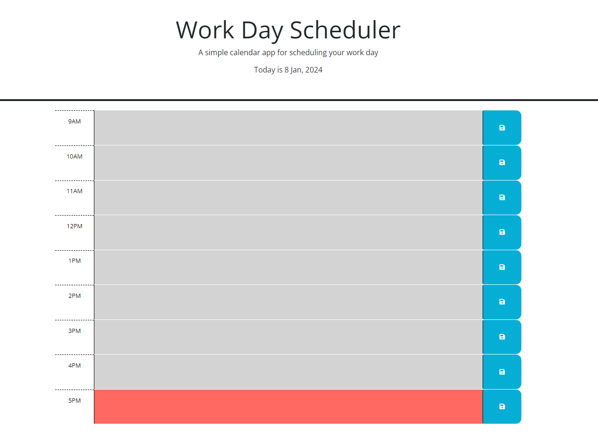

# Word Day Scheduler

## Description

In this weeks challenge for the coding bootcamp, the requirement was to create a daily planner that could aid in a students or employees scheduling.

All that was required was to add some functionality to already existing html and css code so that the page would update dynamincally, based on the time of day, as well a being able to store any imputs from the user.

## Usage

Add any to-do items into the text area of the page. To save said items, click on the blue save icon to the right of the page.

link to the deployed application: https://jlp-55.github.io/Work_day_scheduler/

## Licence

MIT License

Copyright (c) 2024 JLP-55

Permission is hereby granted, free of charge, to any person obtaining a copy
of this software and associated documentation files (the "Software"), to deal
in the Software without restriction, including without limitation the rights
to use, copy, modify, merge, publish, distribute, sublicense, and/or sell
copies of the Software, and to permit persons to whom the Software is
furnished to do so, subject to the following conditions:

The above copyright notice and this permission notice shall be included in all
copies or substantial portions of the Software.

THE SOFTWARE IS PROVIDED "AS IS", WITHOUT WARRANTY OF ANY KIND, EXPRESS OR
IMPLIED, INCLUDING BUT NOT LIMITED TO THE WARRANTIES OF MERCHANTABILITY,
FITNESS FOR A PARTICULAR PURPOSE AND NONINFRINGEMENT. IN NO EVENT SHALL THE
AUTHORS OR COPYRIGHT HOLDERS BE LIABLE FOR ANY CLAIM, DAMAGES OR OTHER
LIABILITY, WHETHER IN AN ACTION OF CONTRACT, TORT OR OTHERWISE, ARISING FROM,
OUT OF OR IN CONNECTION WITH THE SOFTWARE OR THE USE OR OTHER DEALINGS IN THE
SOFTWARE.

